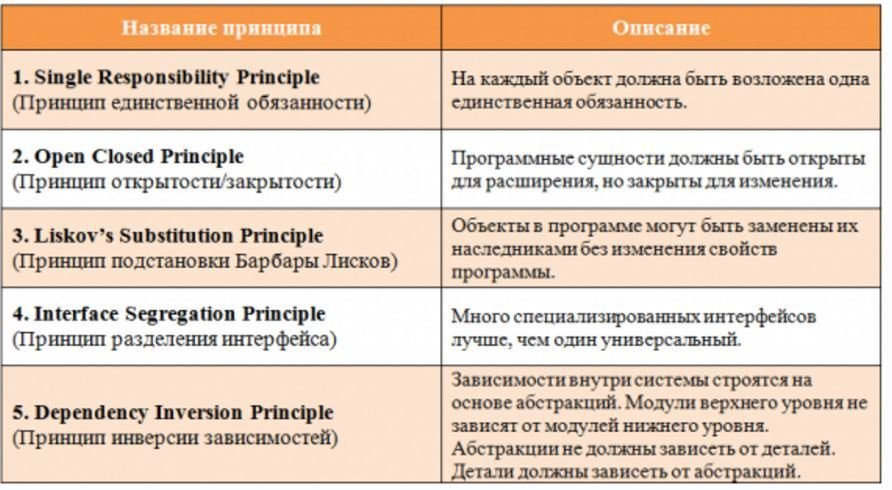

## Yandex Practicum
# Dependency Injection

---

IoC – Inversion of Control (Инверсия управления) - фреймворк вызывает код

DI – Dependency Injection (Внедрение зависимостей)

DIP – Dependency Inversion Principle (Принцип инверсии зависимостей) Модули верхних уровней не должны зависеть от модулей нижних уровней. Оба типа модулей должны зависеть от абстракций
http://sergeyteplyakov.blogspot.com/2014/11/di-vs-dip-vs-ioc.html

### SOLID

### Tight/loose coupling

### Constructor Injection, Method Injection, Property Injection

### Времени компиляции / runtime 
(статическая / динамическая)

### Service locator
скрывает зависимости класса

### Dagger, Koin, Kodein, and Toothpick
https://proandroiddev.com/a-dependency-injection-showdown-213339c76515

### Dagger
component
module, binds, bindsinstance, provides, qualifiers
subcomponent
scope
viewModel https://habr.com/ru/companies/wrike/articles/569918/